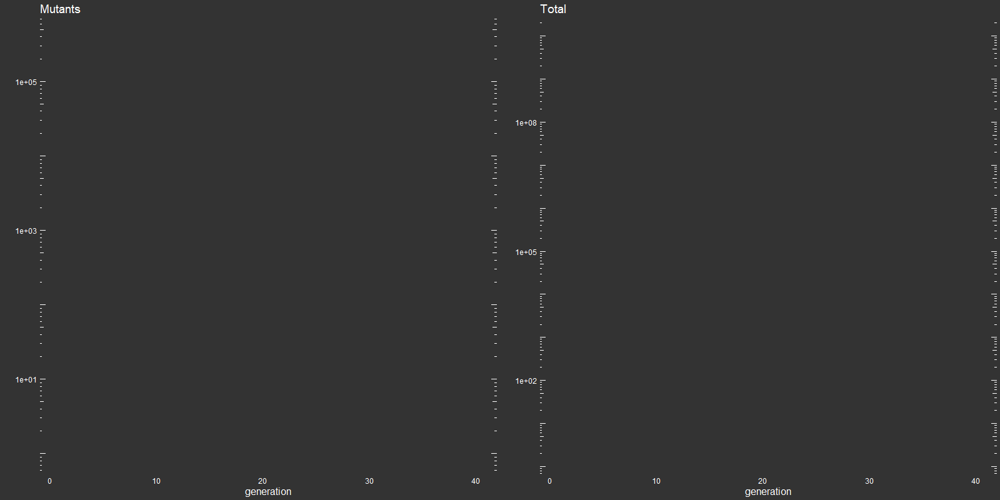
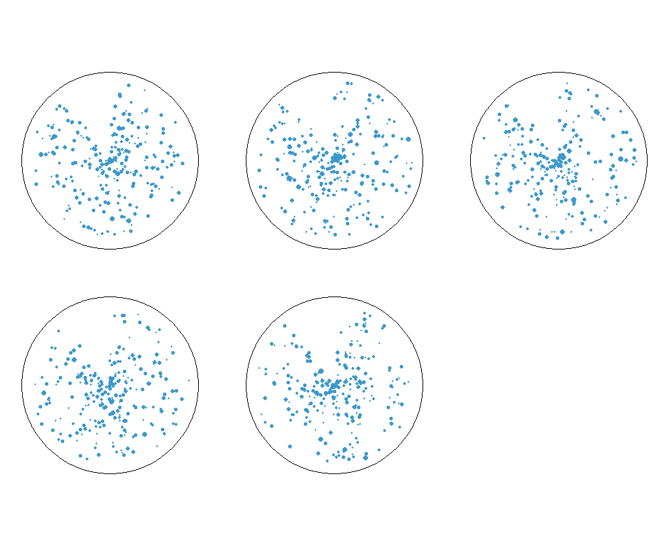
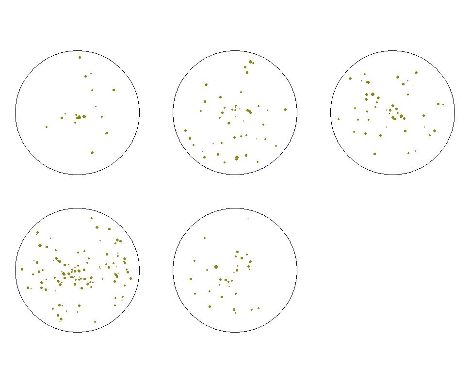

# Luria Delbruck
A shiny app simulation of the Luria Delbruck assay demonstrating the random accumulation of mutations in the absence of selection. (https://philip-leftwich.shinyapps.io/Luria_Delbruck/)

## Background

This simulation is designed to supplement practical work in undergraduate genetics labs at the University of East Anglia.

*E. coli* *mutS*, *mutL* or *mutH* mutants (JW2799, JW4128, JW2702 from the Keio collection) are defective in MMR and are hypermutable i.e. these strains exhibit elevated levels of spontaneous mutation.

So, how will we observe this elevated mutation frequency? Generating targeted mutations is straight forward, the real challenge lies in devising a robust assay for the function of the mutant protein. Sometimes the assay can be conducted in vitro but more often than not it has to be conducted using an in vivo assay. The procedure we use is based on the Luria Delbruck fluctuation assay. In this procedure bacteria are allowed to grow under non-selective conditions and the number of mutants that accumulated in a defined target gene within that time period is determined. In our tests we will determine the level of spontaneous resistance to a defined antibiotic that results from mutations within a single *E. coli* gene.

Rifampicin is an important antibiotic for controlling bacterial diseases (e.g. Mycobacterium tuberculosis) but it is also effective against many other bacteria, including *E. coli*. Rifampicin exerts its antibiotic effect by binding to and inhibiting the \beta subunit of RNA polymerase which in *E. coli* is encoded by the *rpoB* gene. This means that transcripts can no longer be elongated and the cells die. The interaction with rifampicin involves several amino acids in the rpoB protein which have aromatic side chains. If single residues are altered due to mutation, the protein becomes insensitive to rifampicin. E. coli containing the mutated rpoB gene can then grow on media which contains rifampicin. 

## Spontaneous mutations arise from random events

The Luria-Delbrück fluctuation assay is one of the most commonly used methods for measuring the mutation rate in microorganisms. Specifically, it is used to measure the mutation rate at a particular locus or loci at which mutations give rise to a selectable phenotype. 

Here I provide an R shiny application to investigate the effect of generation time & mutation rate on the observance of spontaneous Rifamipican mutants in *E.coli*. This can be used to check practical observations against simulated predictions.

## More on the Luria Delbruck assay

A small number of cells are used to inoculate parallel cultures in a non-selective medium. The cultures are grown to saturation to obtain equal cell densities. 

## Phenotypic assay

The cells are plated onto selective media to obtain the number of mutants (r). Dilutions are plated onto rich medium to calculate the total number of viable cells (Nt). The number of mutants that appear in the saturated culture is a measure of both the mutation rate and when the mutants arise during the growth of the culture: mutants appearing early in the growth of the culture will propagate many more mutants than those that arise later during growth.

### Non-selective plates

## Rifampicin plates

